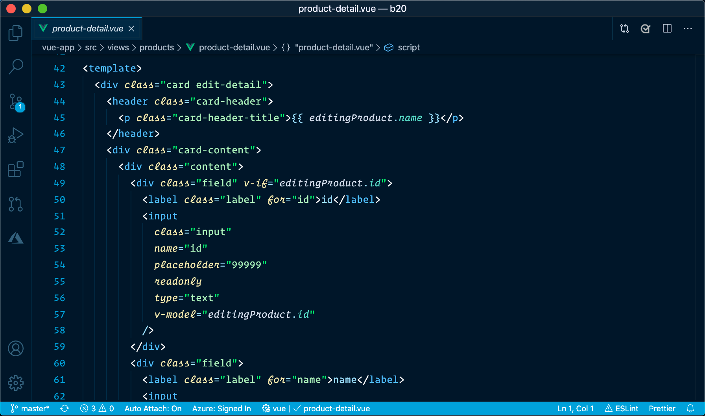
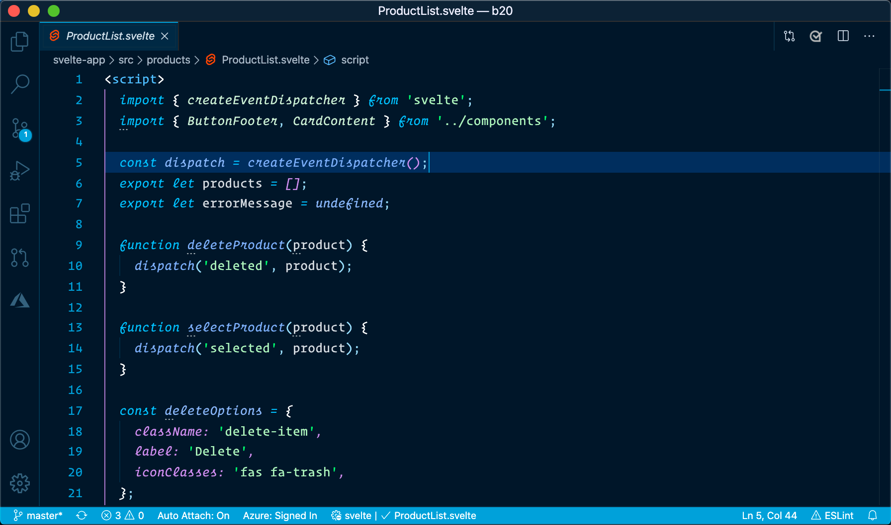
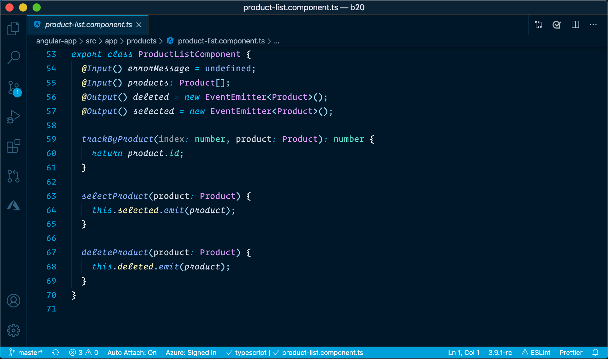
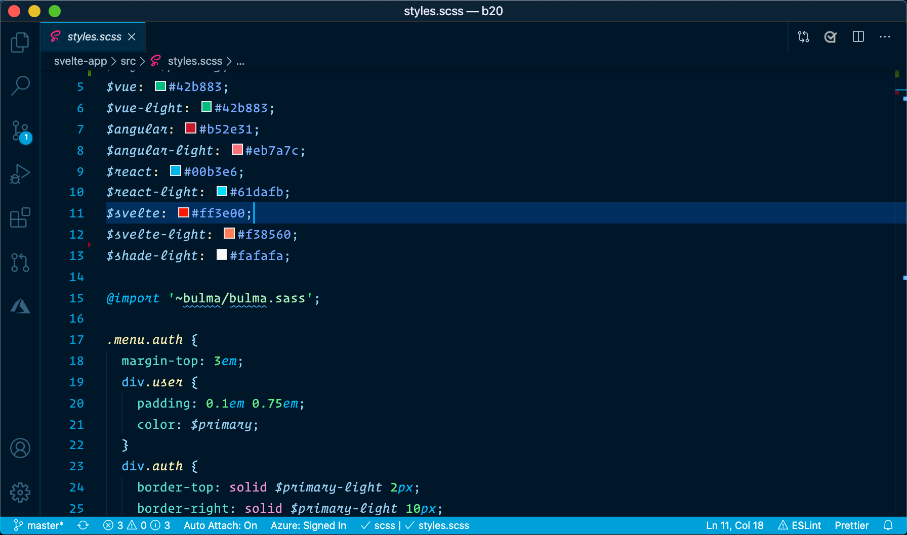
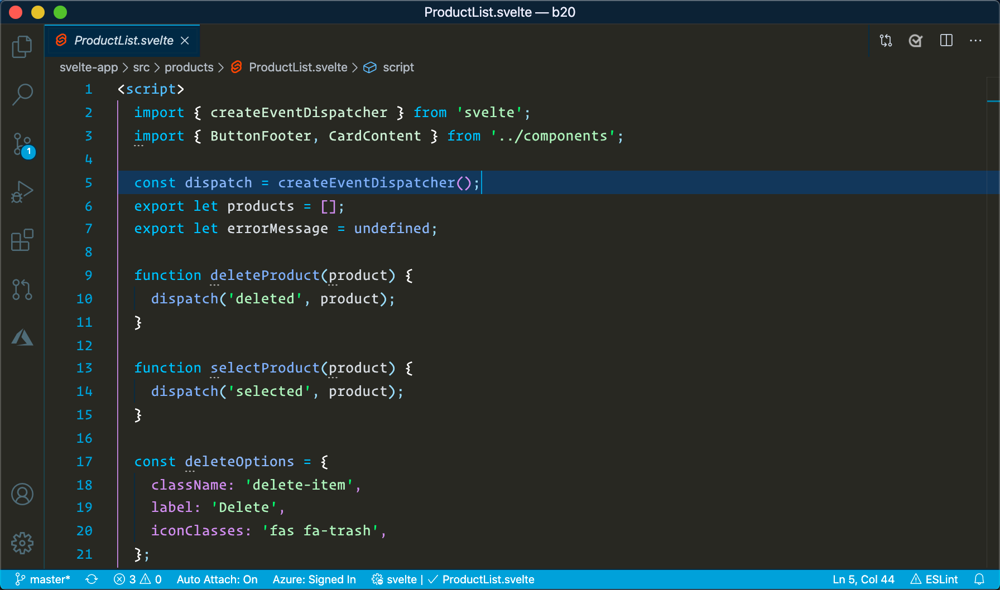
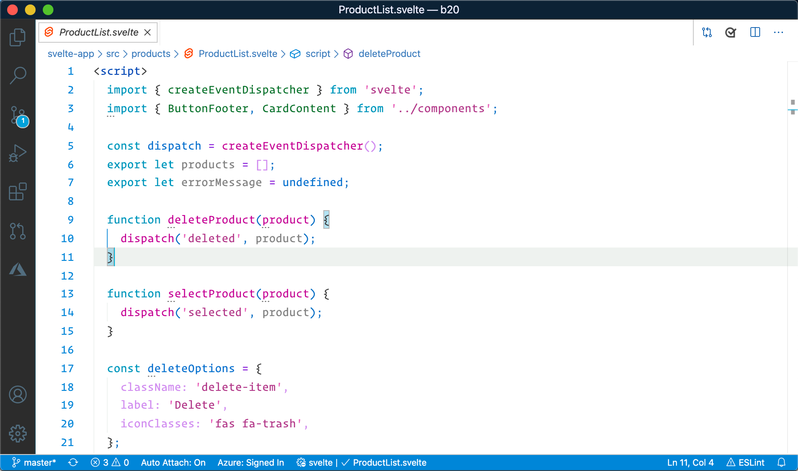

# Md Abdur Rakib Theme

<h1 align="center">
  <br>
    
  <br><br>
  <br>

## Theme Screenshot

PHP


Vue.js


Markdown


Typescript


This extension for Visual Studio Code adds themes titled "Md Abdur Rakib Theme". There are dark, dark with no italics, and light themes.

> I personally use the dark themes for most occasions, but find the light theme good on some dimmer projectors when I present.

See the [CHANGELOG](CHANGELOG.md) for the latest changes.

The themes also support an italicized version, with fonts that supports cursive italicized fonts.

## Dark Blue Theme

**Dark Blue HTML**


**Dark Blue JavaScript**


**Dark Blue TypeScript**


**Dark Blue SCSS**


## Dark Black Theme

**Dark Black JavaScript**


## Light Theme

**Light JavaScript**


## Recommended Settings

## Installation

1. Open the extensions sidebar on Visual Studio Code
1. Search for Md Abdur Rakib Theme
1. Click Install
1. Click Reload to reload your editor
1. Select the Manage Cog (bottom left) > Color Theme ＞ Theme
1. 🌟🌟🌟🌟🌟 Rate five-stars 😃

## Tweaks & theming

If you want to play around with new colors, use the setting `workbench.colorCustomizations ` to customize the currently selected theme. For example, you can add this snippet in your "settings.json" file:

```json
"workbench.colorCustomizations": {
"tab.activeBackground": "#282c34",
"activityBar.background": "#282c34",
"sideBar.background": "#282c34",
}
```

or use the setting `editor.tokenColorCustomizations`

```json
   "editor.tokenColorCustomizations": {
    "[Theme]": {
      "textMateRules": [
        {
          "scope": [
            "source.python"
          ],
          "settings": {
            "foreground": "#e06c75"
          }
        }
      ]
    }
  }
```

### Italic

You could set this in your setting.json to make code be italic

```json
    "editor.tokenColorCustomizations": {
      "textMateRules": [
        {
          "scope": [
            // the following elements will be in italic
            "comment",
            "storage.modifier", // static keyword
            "storage.type.php", // typehints in methods keyword
            "keyword.other.new.php", // new
            "entity.other.attribute-name", // html attributes
            "fenced_code.block.language.markdown", // markdown language modifier
            "keyword", //import, export, return…
            "storage.modifier", //static keyword
            "storage.type", //class keyword
            "keyword.control",
            "constant.language",
            "entity.other.attribute-name",
            "entity.name.method",
            "keyword.control.import.ts",
            "keyword.control.import.tsx",
            "keyword.control.import.js",
            "keyword.control.flow.js",
            "keyword.control.from.js",
            "keyword.control.from.ts",
            "keyword.control.from.tsx"
          ],
          "settings": {
            "fontStyle": "italic"
          }
        },
        {
          "scope": [
            // the following elements will be displayed in bold
            "entity.name.type.class" // class names
          ],
          "settings": {
            "fontStyle": ""
          }
        },
        {
          "scope": [
            // the following elements will be displayed in bold and italic
            "entity.name.section.markdown" // markdown headlines
          ],
          "settings": {
            "fontStyle": "italic"
          }
        },
        {
          "scope": [
            // the following elements will be excluded from italics
            //   (VSCode has some defaults for italics)
            "invalid",
            "keyword.operator",
            "constant.numeric.css",
            "keyword.other.unit.px.css",
            "constant.numeric.decimal.js",
            "constant.numeric.json",
            "comment.block",
            "entity.other.attribute-name.class.css"
          ],
          "settings": {
            "fontStyle": ""
          }
        }
      ]
    },
```

<hr>


```js
{
  "editor.autoIndent": "full",
  "editor.cursorBlinking": "solid",
  "editor.cursorSmoothCaretAnimation": true,
  "editor.cursorStyle": "line",
  "editor.fontSize": 16,
  "editor.fontFamily": "Dank Mono, Fira Code, Inconsolata",
  "editor.fontLigatures": true,
  "editor.formatOnPaste": true,
  "editor.formatOnType": false,
  "editor.formatOnSave": true,
  "editor.letterSpacing": 0.3,
  "editor.lineHeight": 25,
  "editor.minimap.enabled": false,
  "editor.multiCursorModifier": "ctrlCmd",
  "editor.suggestSelection": "first",
  "editor.tabCompletion": "on",
  "editor.tabSize": 2,
  "editor.wordWrap": "on",
  "files.autoSave": "afterDelay",
  "files.autoSaveDelay": 1000,
  "search.showLineNumbers": true,
  "workbench.iconTheme": "material-icon-theme",
  "workbench.colorCustomizations": {},
  "workbench.colorTheme": "Winter is Coming (Dark Blue)",
  "zenMode.centerLayout": false,
}
```


## Fonts

I am using a paid font titled **Dank Mono**. **Operator Mono** is also a paid font that is awesome. If you do not have these fonts, use your favorite font. **Fira Code** is a free one that works well too.

Be nice.

## Authors

<br/>

<h3>Theme is a Official VS Code theme of Developer Md Abdur Rakib is all about teaching web development skills and techniques in an efficient and practical manner. It has all the tools you need to learn the newest and most popular technologies to convert you from a no stack to full stack developer.</h3>

<br />

Authored by [Md Abdur Rakib](https://mdabdurrakib.com/) <br />
Facebook : [Md Abdur Rakib](https://facebook.com/tscmdabdurrakib/) <br/>
Github : [Md Abdur Rakib](https://github.com/tscmdabdurrakib/) <br/>
Instagram : [Md Abdur Rakib](https://instagram.com/tscmdabdurrakib/)<br/>
Linkedin : [Md Abdur Rakib](https://linkedin.com/in/tscmdabdurrakib/)
